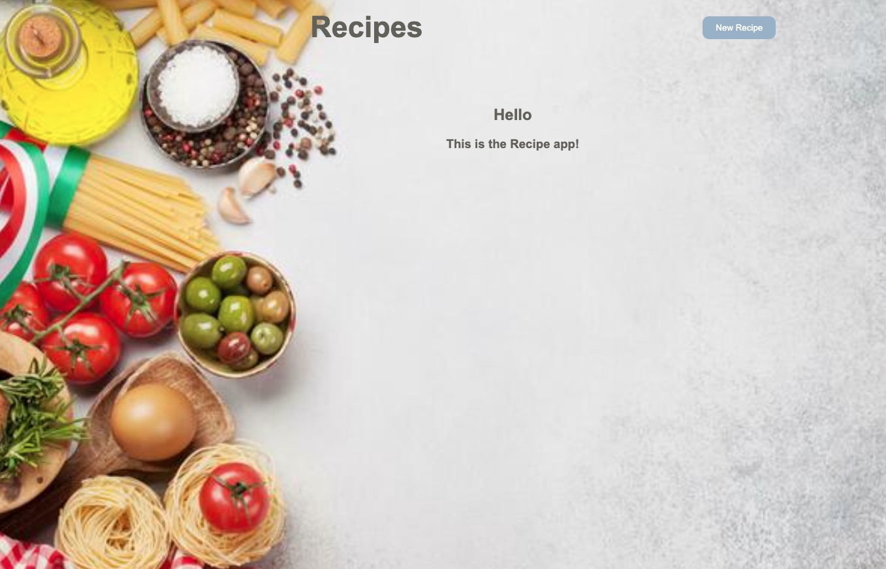

# Recipe App 🎶

Recipe App is a full-stack application that allows users to manage their food recipe collection. Users can view, add, edit, and delete recipes, as well as mark their favorite foods.

 

    

 

## Features

- **CRUD Operations**: Create, Read, Update, Delete recipes.
- **Favorite Foods**: Mark recipe as favorites and toggle the favorite status directly from the index page.
- **Responsive Design**: Uses Bootstrap for styling.
- **404 Page**: Custom 404 page for unknown routes.
- **Confirmation Prompt**: Confirmation prompt before deleting a recipe.

 

    

 

## Table of Contents

- [Installation](#installation)
- [Usage](#usage)
- [API Endpoints](#api-endpoints)
- [Components](#components)
- [Contributing](#contributing)

## Installation

1. Clone the repository:
   git clone https://github.com/manoelteixeira/recipe-app-front-end.git
   cd recipe-app-frontend
## Install dependencies:
npm install

## Create a .env file and add your environment variables:
VITE_BASE_URL=http://localhost:4001

## Run the server:
npm run dev

## Usage
  . Navigate to http://localhost:4001 in your browser to use the Recipe App.
  . Use the navigation bar to view all recipes or add a new recipe.
  . Click on a food's name to view its details.
  . Use the edit button on the recipe detail page to update the recipe's information.
  . Click the delete button to remove a recipe (a confirmation prompt will appear).
  . Toggle the favorite status by clicking on the star icon in the recipes list.

## API Endpoints
Recipes
  . GET /recipes: Get all recipes.
  . POST /recipes: Add a new recipe.
  . GET /recipes/:id: Get a single recipe by ID.
  . PUT /recipes/:id: Update a recipe by ID.
  . DELETE /recipes/:id: Delete a recipe by ID.

## Components
  . NavBar
   -Navigation bar with links to the recipes list and add new recipe page.

  . Recipe
   -Component to display individual recipe details with a clickable star to toggle the favorite status.

  . RecipeDetails
   -Component to display detailed information about a recipe with options to edit or delete the recipe.

  . RecipeEditForm
  -Form to edit the details of a recipe.

  . RecipeNewForm
  -Form to add a new recipe.

  . Recipes
  -Component to display a list of all recipes in a table format.

  . Layout
  -Component implementing the Holy Grail Layout.

## Contributing
   . Fork the repository.
   . Create a new branch (git checkout -b feature-branch).
   . Make your changes.
   . Commit your changes (git commit -m 'Add some feature').
   . Push to the branch (git push origin feature-branch).